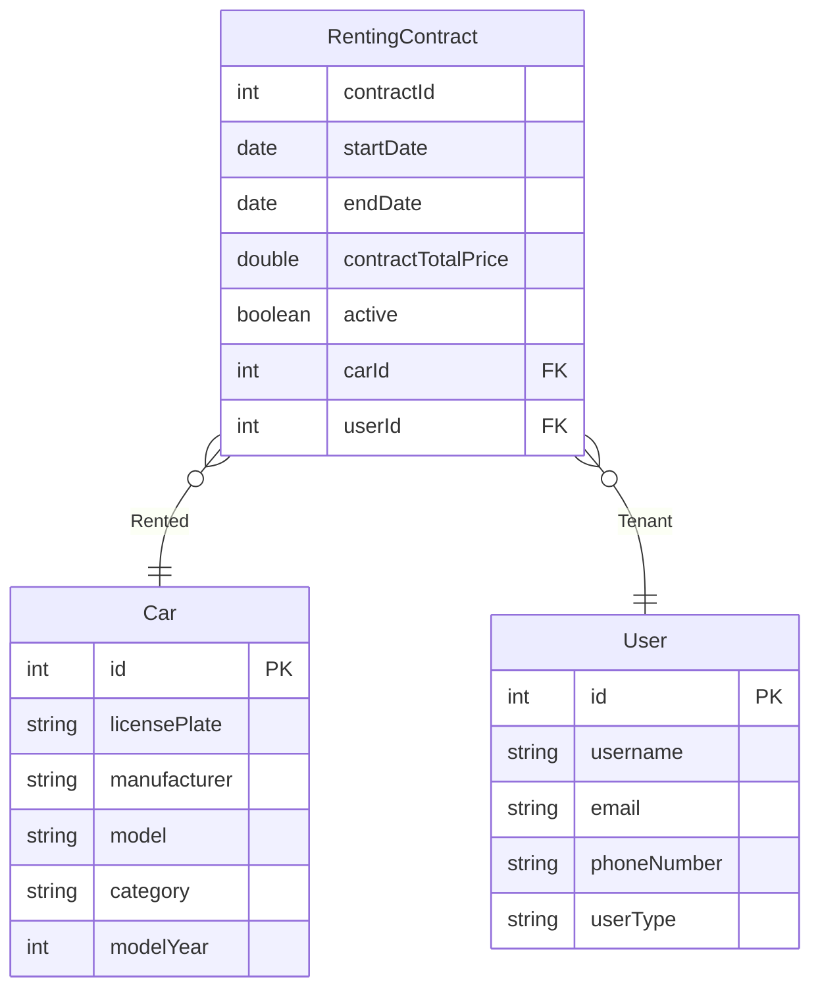

## Documentação da API

### Carros

#### Retorna todos os carros cadastrados no sistema

```http
  GET /cars/
```

| Parâmetro   | Tipo       | Descrição                           |
| :---------- | :--------- | :---------------------------------- |
| `available` | `boolean` | **opcional**. Indica se a busca retornará apenas os carros disponíveis |

#### Retorna todos os carros de um modelo

```http
  GET /cars/models/${modelName}
```

| Parâmetro   | Tipo       | Descrição                                   |
| :---------- | :--------- | :------------------------------------------ |
| `modelName`      | `string` | **Obrigatório**. O nome do modelo buscado |

#### Retorna todos os carros de um fabricante

```http
  GET /cars/manufacturers/${manufacturerName}
```

| Parâmetro   | Tipo       | Descrição                                   |
| :---------- | :--------- | :------------------------------------------ |
| `manufacturerName`      | `string` | **Obrigatório**. O nome do fabricante |

#### Retorna todos os carros de uma categoria

```http
  GET /cars/categories/${categoryName}
```

| Parâmetro   | Tipo       | Descrição                                   |
| :---------- | :--------- | :------------------------------------------ |
| `categoryName`      | `string` | **Obrigatório**. O nome da categoria

#### Retorna todos os carros de um ano

```http
  GET /cars/model-years/${modelYear}
```

| Parâmetro   | Tipo       | Descrição                                   |
| :---------- | :--------- | :------------------------------------------ |
| `modelYear`      | `int` | **Obrigatório**. O valor do ano do modelo |

#### Registra um carro

```http
  POST /cars/
```

| Parâmetro   | Tipo       | Descrição                                   |
| :---------- | :--------- | :------------------------------------------ |
| `modelName`      | `Request body` | **Obrigatório**. Placa do carro, disponibilidade e nome do modelo do carro |

#### Atualiza um carro

```http
  PUT /cars/{id}
```

| Parâmetro   | Tipo       | Descrição                                   |
| :---------- | :--------- | :------------------------------------------ |
| `ID`      | `int` | **Obrigatório**. Id do carro a ser atualizado |

#### Exclui um carro

```http
  DELETE /cars/{id}
```

| Parâmetro   | Tipo       | Descrição                                   |
| :---------- | :--------- | :------------------------------------------ |
| `ID`      | `int` | **Obrigatório**. Id do carro a ser excluído |


## Diagrama de entidades ##


