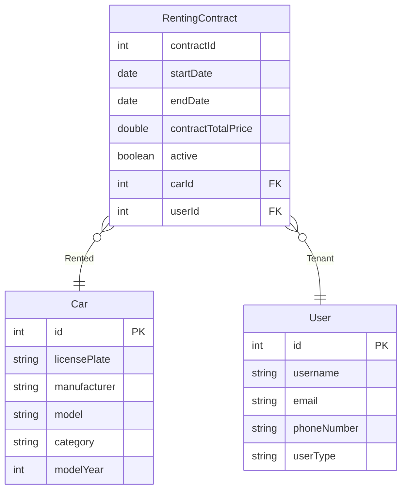

## Diagrama de entidades ##

```mermaid
erDiagram
    RentingContract {
        int contractId
        date startDate
        date endDate
        double contractTotalPrice
        boolean active
        int carId FK
        int userId FK
    }

    Car {
        int id PK
        string licensePlate
        string manufacturer
        string model
        string category
        int modelYear
    }

    User {
        int id PK
        string username
        string email
        string phoneNumber
        string userType
    }

    RentingContract }o--|| Car : "Rented"
    RentingContract }o--|| User : "Tenant"
```
